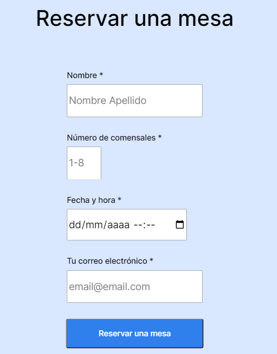
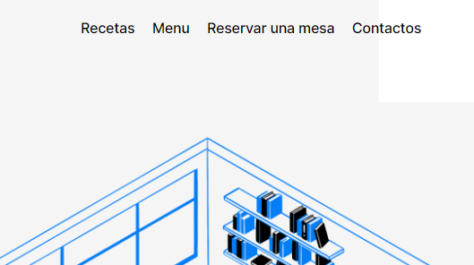

NOMBRE DEL PROYECTO: Coffee Shop.

DESCRIPCIÓN: Pagina web de una cafetería con menú y sección de recetas, ademas cuenta con reservaciones online.

- Se utiliza Flexbox para el posicionamiento de los elementos
- Cuenta con enlaces en el encabezado que nos llevan a cada sección de la página.
- Se utiliza la metodología BEM para el nombramiento de clases.
- Videos de YouTube incrustados que muestran contenido relacionado.

PLANES DE MEJORA:

- Crear animaciones con cierto retardo para que las cosas vayan apareciendo según se hace scroll.
- Transiciones en los enlaces y título principal.
- Mantener el nav fijo en la parte superior para versiones de escritorio y en la parte inferior para versiones mobile.
- Crear una animación con en el header con la imagen de fondo que esté siempre en constane movimiento como atractivo visual.

FUNCIONES:

1. **Reservación online de una mesa**
   

2. **Menú con las secciones que te llevan a distintas secciones de la página sin necesidad de hacer scroll**
   
